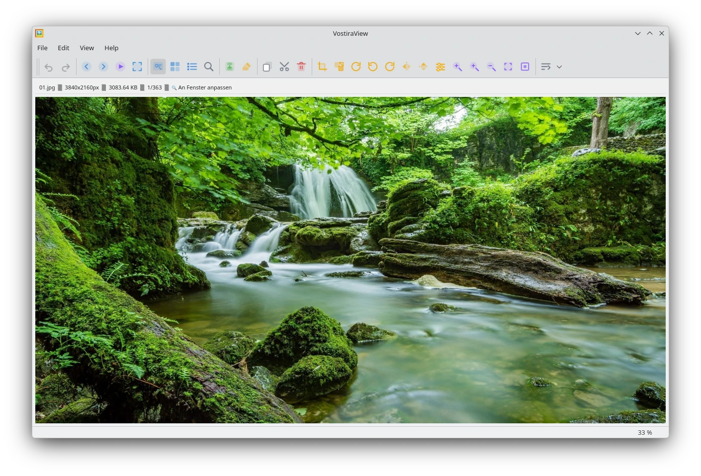

# 🖼️ vostiraview – Image Viewer

**Moderner Bildbetrachter mit Bearbeitungsfunktionen – plattformunabhängig und leistungsstark**

<<<<<<< HEAD

© 2026 vostiraview – Version 1.72
=======

>>>>>>> c73167466e689ede3e6130eb639a56757f3ec250
---

## 🇩🇪 Deutsch

### 🚀 Hauptfunktionen im Überblick

#### 🖼️ Bildbetrachtung
- Unterstützt PNG, JPG, JPEG, GIF, BMP, WebP
- Navigation per Pfeiltasten oder Toolbar
- **Zoom** mit Mausrad + Panning (ziehen)
- **Vollbild** (Taste V)
- **Slideshow** mit einstellbarem Intervall (Taste P)

#### 📂 Galerie‑Ansicht
- **Zwei Modi**: Raster (Thumbnails) und Liste (mit Metadaten)
- Umschaltung per Toolbar‑Button
- Markierung per Klick (roter Rahmen, 1 Pixel)
- Drag & Drop zum Hinzufügen von Bildern
- Sortierung nach Name, Datum, Größe
- **Suche** (Taste F) über Dateinamen

#### ✂️ Bildbearbeitung
- **Zuschneiden** (Crop) mit interaktivem Rechteck (Taste C)
- **Größe ändern** (Resize) in % oder Pixel (Taste A)
- **Drehen** (90°, 180°, 270° oder benutzerdefiniert, Taste D)
- Alle Bearbeitungen als neue Datei speichern (Original bleibt)

#### 📁 Dateiverwaltung
- Öffnen, Speichern unter, Umbenennen (O, S, U)
- **Löschen** von Einzelbildern oder Mehrfachauswahl (Del)
- Kopieren / Ausschneiden / Einfügen mit System‑Zwischenablage (Ctrl+C/X/V)
- Drag & Drop in die Galerie (Dialog: Kopieren oder nur anzeigen)

#### 📷 EXIF‑Daten
- Anzeige aller EXIF‑Tags inkl. Rohdaten (Taste E)
- Zusammenfassung in der Statusleiste (Kamera, Belichtung, Blende, ISO, Brennweite, Datum)

#### ⌨️ Hilfe & Bedienung
- **Tastaturkürzel‑Übersicht** (Taste H oder ?)
- **Über‑Dialog** mit Versionsinfo
- Kontextabhängige Menü‑ und Toolbar‑Sichtbarkeit

---

### ✨ Was vostiraview auszeichnet

- **Durchdachte Benutzeroberfläche** – thematisch gruppierte Toolbar (Navigation, Datei, Zwischenablage, Bildbearbeitung, Sortierung, Ansichtsumschaltung); Statusleiste mit Echtzeit‑Informationen.
- **Flexible Galerie mit zwei Ansichten** – Raster (Thumbnails mit Dateinamen auf dem Bild) und Liste (zusätzlich Metadaten wie Auflösung, Größe, Datum). Umschaltung mit einem Klick.
- **Intelligente Zwischenablage‑Integration** – Kopieren, Ausschneiden, Einfügen systemweit; beim Ausschneiden werden Originale erst beim Einfügen gelöscht.
- **Leistungsstarke Such‑ und Sortierfunktion** – Echtzeit‑Suche nach Dateinamen; Sortierung nach Name, Datum, Größe (auf‑/absteigend).
- **Nahtlose Drag & Drop‑Integration** – Bilder aus dem Datei‑Explorer in die Galerie ziehen; Dialog mit Optionen (Kopieren oder nur anzeigen).
- **Modulare, wartbare Code‑Struktur** – klare Trennung von UI und Funktionalität, leicht erweiterbar.
- **Schnelle, flüssige Bedienung** – Thumbnail‑Cache, inkrementelles Laden, optimierte Größenanpassung.
- **Plattformunabhängig** – läuft unter Linux, Windows und macOS; Konfiguration wird benutzerspezifisch gespeichert.

---

### 🧩 Technische Details

- **Sprache:** Python 3.10+
- **GUI‑Framework:** PyQt6
- **Bildverarbeitung:** PIL (Pillow) für EXIF, Qt‑eigene Funktionen für Skalierung, Rotation, Zuschneiden
- **Unterstützte Formate:** PNG, JPG, JPEG, GIF, BMP, WebP (erweiterbar)
- **Konfiguration:** Textdatei im Benutzer‑Verzeichnis (`~/.config/vostiraview/`)
- **Abhängigkeiten:** PyQt6, Pillow – einfach installierbar

---

### 📌 Kurz zusammengefasst

**vostiraview** ist ein professioneller, aber dennoch einfacher Bildbetrachter, der sich durch seine **doppelte Galerie‑Ansicht**, die **umfangreichen Bearbeitungsfunktionen** und die **durchdachte Bedienung** auszeichnet. Ideal für Fotografen, Designer und alle, die täglich mit vielen Bildern arbeiten – ob zur schnellen Sichtung, zur Organisation oder zur einfachen Nachbearbeitung.

> Probieren Sie es aus – die Tastaturkürzel machen Sie im Handumdrehen zum Profi! 🚀

---

## 🇬🇧 English

### 🚀 Main Features Overview

#### 🖼️ Image Viewing
- Supports PNG, JPG, JPEG, GIF, BMP, WebP
- Navigate with arrow keys or toolbar
- **Zoom** with mouse wheel and pan (drag)
- **Fullscreen** (key V)
- **Slideshow** with adjustable interval (key P)

#### 📂 Gallery View
- **Two modes**: Grid (thumbnails) and List (with metadata)
- Toggle via toolbar button
- Selection by click (red border, 1 pixel)
- Drag & drop to add images
- Sort by name, date, size
- **Search** (key F) by filename

#### ✂️ Image Editing
- **Crop** with interactive rectangle (key C)
- **Resize** by percent or pixels (key A)
- **Rotate** (90°, 180°, 270° or custom, key D)
- All edits saved as new file (original preserved)

#### 📁 File Management
- Open, Save As, Rename (O, S, U)
- **Delete** single or multiple selection (Del)
- Copy / Cut / Paste with system clipboard (Ctrl+C/X/V)
- Drag & drop into gallery (dialog: Copy or just show)

#### 📷 EXIF Data
- View all EXIF tags including raw data (key E)
- Summary in status bar (camera, exposure, aperture, ISO, focal length, date)

#### ⌨️ Help & Usability
- **Keyboard shortcuts overview** (key H or ?)
- **About dialog** with version info
- Context‑sensitive menu and toolbar visibility

---

### ✨ What makes vostiraview stand out

- **Thoughtful user interface** – thematically grouped toolbar (Navigation, File, Clipboard, Editing, Sorting, View toggle); status bar with real‑time information.
- **Flexible gallery with two views** – Grid (thumbnails with filename overlaid) and List (additional metadata like resolution, size, date). Toggle with one click.
- **Smart clipboard integration** – Copy, cut, paste system‑wide; cut deletes originals only after paste.
- **Powerful search and sort** – real‑time filename search; sort by name, date, size (ascending/descending).
- **Seamless drag & drop** – drag images from file explorer into gallery; dialog with options (Copy or just show).
- **Modular, maintainable code structure** – clear separation of UI and functionality, easy to extend.
- **Fast and smooth operation** – thumbnail cache, incremental loading, optimised resizing.
- **Cross‑platform** – runs on Linux, Windows, macOS; user‑specific configuration storage.

---

### 🧩 Technical Details

- **Language:** Python 3.10+
- **GUI Framework:** PyQt6
- **Image Processing:** PIL (Pillow) for EXIF, Qt‑native functions for scaling, rotation, cropping
- **Supported Formats:** PNG, JPG, JPEG, GIF, BMP, WebP (extendable)
- **Configuration:** Text file in user directory (`~/.config/vostiraview/`)
- **Dependencies:** PyQt6, Pillow – easy to install

---

### 📌 In a Nutshell

**vostiraview** is a professional yet simple image viewer, distinguished by its **dual gallery view**, **comprehensive editing features**, and **well‑thought‑out usability**. Perfect for photographers, designers, and anyone who works with many images daily – whether for quick browsing, organisation, or basic post‑processing.

> Give it a try – the keyboard shortcuts will turn you into a power user in no time! 🚀

---

© 2026 vostiraview – Version 1.0
